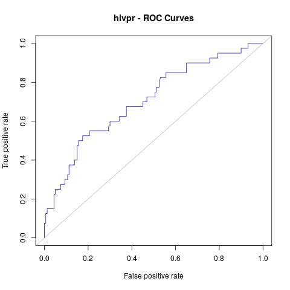

# Validation of docking with rDock and PLANTS using the DEKOIS CDK2 dataset

This experiment uses the DEKOIS datasets for CDK2 to validate docking with rDock.
The output is a ROC curve showing the enrichment.
We are also working towards doing the same using PLANTS.

## Requirements

Nextflow and Docker must be installed on the host machine.

## To run 

### 1. Copy files

Copy the relevant files from /datasets/DEKOIS_2.0.

```sh
./1_copy_files.sh
```

### 2. Prepare inputs

Use OpenBabel to convert the protein to MOL2 format and the bound ligand to SDF format. 


```sh
./2_prepare_inputs.sh
```

The results are the files cdk2_protein.mol2 and xtal-lig.sdf

### 3. Create cavity

rDock needs a cavity defintion. In this case we use the rbcavity program that uses a cound ligand to define the 
cavity.

```sh
./3_create_cavity.sh
```

The results are the cdk2_rdock_cav1.grd and cdk2_rdock.as files.

This runs the rbcavity in the [informaticsmatters/rdock/](https://hub.docker.com/r/informaticsmatters/rdock/) 
Docker image.

### 4. Perform docking with rDock

This runs the docking using [Nextflow](http://nextflow.io) which executes each of the stages, parallelising
the computationally demanding process of doing the actual dockings according to the number of cores on the machine.
See the rdock.nf file for details.

```sh
./4_run_rdock.sh
```
The result is the rdock_results.sdf.gz file.

This uses the [informaticsmatters/rdkit_pipelines](https://hub.docker.com/r/informaticsmatters/rdkit_pipelines/) 
and [informaticsmatters/rdock/](https://hub.docker.com/r/informaticsmatters/rdock/) 
Docker images.

**Note** this will take some time depending on the power of your computer.

### 4. Perform docking with PLANTS

Runs docking using PLANTS. This is currently an optional step as the results are not yet processed and ROC curves are not generated.

```sh
./5_run_plants.sh
```

This uses the [informaticsmatters/plants](https://hub.docker.com/r/informaticsmatters/plants/) Docker image.
Please take a look at that link for information about PLANTS licensing.

**Note** This is not currently parallelised

**Note** this will take some time depending on the power of your computer.

### 6. Prepare the ROC curve data

This filters the docked structures to find the best score for each structure and then generates the input
that is needed by R. 

```sh
./6_prepare_roc.sh
```

The result is the file rdock_results_1poseperlig.sdf.gz which contains the best pose for each ligand and data extracted
from that file that is needed by R (the rdock_dataforR_uq.txt).

This uses the [informaticsmatters/rdock](https://hub.docker.com/r/informaticsmatters/rdock/builds/) Docker image
that contains the rDock programs.

### 7. Generate ROC curve

This uses the data from the previous step to geneate a JPG with the ROC curve.

```sh
./7_generate_roc.sh
```

The result is the JPG file cdk2_rdock_ROC.jpg




This uses the [informaticsmatters/r-roc](https://hub.docker.com/r/informaticsmatters/r-roc/builds/) Docker image 
that contains R and the ROCR package.


