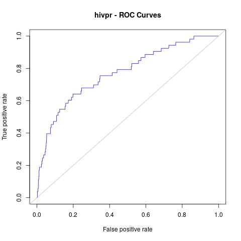

# ROC curve generation

This is an example of generating ROC curves from virtual screening data generated using rDock.

It's based on the example provided by rDock that can be found 
[here](http://www.ub.edu/cbdd/?q=content/how-calculate-roc-curves).

It is not a complete example as it uses already generated docking scores that are contained in
the file hivpr_all_results.sd.gz

## Requirements

Docker must be installed on the host machine.

## To run

### Download data

The hivpr_all_results.sd.gz input file is too large to store in GitHub so we download it instead.
We also grab ligands.txt and decoys.txt that define which ligands are actives and which are decoys.


```sh
1_download_data.sh
```

The result is the downloaded hivpr_all_results.sd.gz, ligands.txt and decoys.txt files.


### Prepare the data

This filters the docked structures to find the best score for each structure and then generates the input
that is needed by R. 

```sh
./2_prepare_data.sh
```

This takes a few minutes
The result is the file hivpr_1poseperlig.sdf.gz which contains the best pose for each ligand and data extracted
from that file that is needed by R (the file dataforR_uq.txt).

This uses the [informaticsmatters/rdock](https://hub.docker.com/r/informaticsmatters/rdock/builds/) Docker image
that contains the rDock programs.

### Generate ROC curves

This uses the data from the previous step to geneate a JPG with the ROC curve.

```sh
./3_generate_roc.sh
```

The result is the JPG file hivpr_Rinter_ROC.jpg




This uses the [informaticsmatters/r-roc](https://hub.docker.com/r/informaticsmatters/r-roc/builds/) Docker image 
that contains R and the ROCR package.

## TODO

1. Create a more complete example based on data from DUD-E.
1. Look into generating outputs in different formats.
1. Look into generating ROC curves that combine/compare different datasets.
